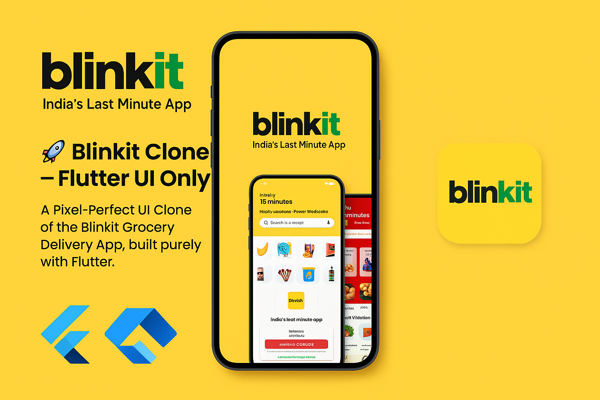

# 🚀 Blinkit Clone — Flutter UI Only

<p align="center">
  
</p>

<p align="center">
  <em>A Pixel-Perfect UI Clone of the Blinkit Grocery Delivery App, built purely with Flutter.</em>
</p>

---

<p align="center">

  
  
  
  
  

</p>

---

## 🎥 Live App Preview

<p align="center">
  
</p>

*A smooth walkthrough covering Splash → Login → Home → Categories → Cart → Print Screens.*

---

# 🛒 Blinkit Clone (UI Only)

A **Flutter UI Clone** of the Blinkit grocery delivery app — designed to replicate the clean, modern, and fast look of the real Blinkit interface.
This project focuses purely on **UI design**, **component reusability**, and **layout responsiveness**, without any backend logic or state management.

---

## ✨ Features

1. **Modern Splash Screen**
   Clean and brand-focused intro screen.

2. **Login Screen UI**
   Simple and elegant login layout.

3. **Home Screen**
   Product listing, banner, categories slider, and Add buttons like Blinkit.

4. **Category Screen**
   Grid-based category tiles using PNG assets.

5. **Cart Screen**
   Static UI showing bill summary design.

6. **Print Screen**
   UI mockup designed for a print-style summary.

7. **Consistent UI Theme**
   Blinkit-inspired colors and spacing.

8. **Reusable Widgets**
   `uihelper.dart` for helper widgets and methods.

9. **Fully Responsive Layout**
   Works on all screen sizes.

---

## 🧱 Tech Stack

| Layer            | Technology             |
| ---------------- | ---------------------- |
| Framework        | Flutter                |
| Language         | Dart                   |
| State Management | None (UI Only)         |
| Design           | Custom Flutter Widgets |
| Assets           | Local images (PNG)     |

---

## 📂 Folder Structure

```bash
lib/
│
├── domain/
│   └── constants/
│       └── appcolors.dart
│
├── repository/
│   └── widgets/
│       └── uihelper.dart      # Reusable UI helper functions
│
├── screens/
│   ├── splash_screen.dart
│   ├── login_screen.dart
│   ├── home_screen.dart
│   ├── cart_screen.dart
│   ├── category_screen.dart
│   └── print_screen.dart
│
└── main.dart                  # Entry point
```

---

## 🖼️ App Screenshots

### Splash & Login

| Splash Screen                                          | Login Screen                                          |
| ------------------------------------------------------ | ----------------------------------------------------- |
|  |  |

### Home & Categories

| Home Screen                                          | Categories Screen                                          |
| ---------------------------------------------------- | ---------------------------------------------------------- |
|  |  |

### Cart & Print

| Cart Screen                                          | Print Screen                                          |
| ---------------------------------------------------- | ----------------------------------------------------- |
|  |  |

---

## ⚙️ Getting Started

### 1. Clone the repository

```bash
git clone https://github.com/Sid-9822643898/blinkit_clone_ui.git
```

### 2. Navigate to project directory

```bash
cd blinkit_clone_ui
```

### 3. Install dependencies

```bash
flutter pub get
```

### 4. Run the app

```bash
flutter run
```

---

## 📜 License

This project is under the **MIT License** — feel free to use the UI code in your own apps.

---

## 💬 Feedback or Suggestions?

If you'd like extra animations, transitions, a new screen, or a full backend integration — feel free to ask!

